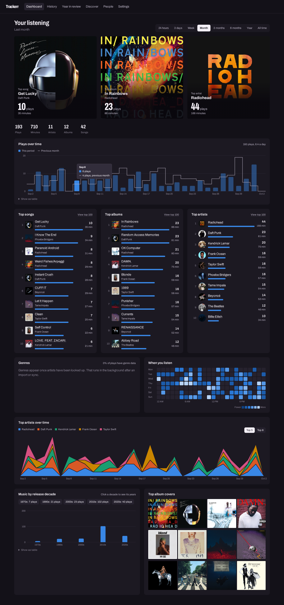

# Spotify Trackerr

Self-hosted listening stats for a few people: top songs, albums and artists for any time range,
genres, charts, a full play history, per-song/album/artist history, a year-in-review page, and
recommendations. New plays sync from Spotify every 5 minutes; past plays come from Spotify's
extended streaming history export.



More in [docs/screenshots](docs/screenshots): song, artist and album pages, history, year in review,
Discover, People, Settings, and the phone layout. They use made-up demo plays.

## Run it

```sh
cp .env.example .env      # fill it in (see below)
docker compose up -d --build
tailscale serve --bg --https=8447 http://127.0.0.1:3457
```

Once you have a Cloudflare tunnel token in `.env`, add the tunnel with
`docker compose --profile tunnel up -d`.

Open https://hermes.tail36fb9.ts.net:8447. The first account you create is the admin.

If a device says the name can't be found, its Tailscale DNS is off. Turn on *Use Tailscale DNS* in
its Tailscale app (and switch off Chrome's *Use secure DNS*), or use http://100.100.64.121:8448
(set `TAILSCALE_IP` and add that address to `ALLOWED_HOSTS`). Spotify sign-in only works from the
https name.

## Setup checklist

1. **Spotify app.** At https://developer.spotify.com/dashboard create an app (Web API), add both
   redirect URIs from `.env.example`, and copy the Client ID and secret into `.env`. Your account
   must have Premium. Under *User Management*, add the Spotify accounts of everyone who will use it
   (Spotify allows 5 per app). More people? Each can create their own app and paste it into
   *Settings > Use your own Spotify app*.
2. **Cloudflare Tunnel.** Create a tunnel in Cloudflare Zero Trust, give it a public hostname
   that points to `http://app:3000`, and put the token in `CLOUDFLARE_TUNNEL_TOKEN`. Add that
   hostname to `ALLOWED_HOSTS` and as a Spotify redirect URI, then run
   `docker compose --profile tunnel up -d`.
3. **Optional keys.** `LASTFM_API_KEY` enables similar songs/artists and better genres.
   `LISTENBRAINZ_TOKEN` enables the Discover playlist for everyone; each person can also add their own token in Settings. Features hide when a key is missing.
4. **Import history.** Request *Extended streaming history* at https://www.spotify.com/account/privacy/
   and upload the zip in Settings when it arrives (up to 30 days).

Spotify ends each link 6 months after sign-in. The app warns two weeks ahead; click
*Reconnect Spotify* to renew.

## How it counts

- A play counts if it lasted 30 seconds or the song finished. Private sessions, podcasts and
  audiobooks are left out.
- Re-importing is safe. A play from a different source (import vs. live sync) within 3 minutes
  (or the song's length, if longer) of an existing play is treated as the same play.
- Plays credit the song's main artist.
- Artwork comes from Deezer (iTunes as fallback), genres from Spotify then Last.fm, both looked up
  in the background, most-played first.

## Develop

```sh
npm install
npm run dev     # http://127.0.0.1:5173
npm test
npm run check
```

Data lives in SQLite at `$DATA_DIR/trackerr.db` (`./data` by default).
